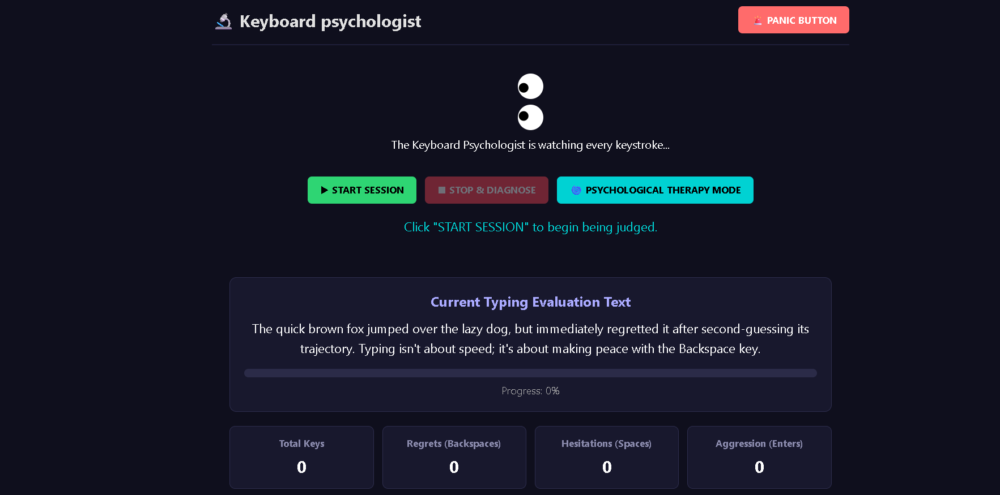

Keyboard Psychologist 🎯
Basic Details
Team Name: Error 404: Team not Found

Team Members:

Team Lead: Biniya Ann Jacob - Carmel College of Engineering and Technology, Alappuzha

Member 2: Sanjana Suresh - Carmel College of Engineering and Technology, Alappuzha

Project Description
Keyboard Psychologist is an intelligent keystroke-dynamics analyzer that monitors how you type to detect your emotional state in real time. By evaluating typing speed, key-press duration, backspace frequency, and pauses, it acts as a virtual therapist for your keyboard, offering gentle reminders, mood updates, or quick micro-break prompts when it detects frustration, stress, or exhaustion.

The Problem (that doesn't exist)
Keyboards are emotionless plastic slabs that take absolute abuse whenever you are stressed, angry, or over-caffeinated. Millions of innocent mechanical switches suffer aggressive rage-typing every day, while users blindly type through burnout without realizing their stress levels are skyrocketing until they smash the backspace key through the desk.

The Solution (that nobody asked for)
We built a non-intrusive background service that turns every keystroke into a psychological data point. If you start aggressively mashing backspace at 120 WPM, Keyboard Psychologist flags high frustration, changes your RGB keyboard backlight to a calming blue, and pops up a gentle prompt suggesting you take a deep breath before sending that passive-aggressive email.

Technical Details
Technologies/Components Used
For Software:
Languages: Python 3.11, JavaScript (Node.js)

Frameworks: Electron.js, Flask, scikit-learn

Libraries: pynput (keystroke logging), NumPy, Pandas, Chart.js

Tools: VS Code, Git, Figma (UI Design)

Implementation
For Software:
Installation
Bash
git clone https://github.com/error404-teamnotfound/keyboard-psychologist.git
cd keyboard-psychologist
pip install -r requirements.txt
npm install
Run
Bash
# Start backend analysis engine
python engine.py

# Launch frontend desktop interface
npm start
Project Documentation
For Software:
Screenshots :
Real-time graph tracking typing speed variance, dwell time, and calculated anger/stress levels.

Alert pop-up triggered after detecting erratic backspace spams and rapid key slams.

Daily summary showing emotional trends across work sessions and typing speed correlation.

Diagrams
Data pipeline showing low-level keyboard event capture, timing-metric extraction, ML emotion classification, and real-time dashboard updates.

Project Demo
Video
https://drive.google.com/drive/folders/1IOuLDFt7oL8px4RCNNehOjEVHgGOQ0k0?usp=sharing
Watch the Keyboard Psychologist Demo Video
Demonstrates live keystroke analysis, real-time stress level shifts during fast typing, and the physical mood-lighting response.

Additional Demos
Interactive Keystroke Mood Test — Test how your typing rhythm translates to mood metrics right in your browser.

